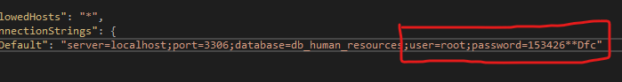

# HumanResourcesAPI Test

### Clonando el proyecto
~~~ 
https://github.com/diegoflores20173372/HumanResourcesAPI.git
~~~ 

### Instalacion
Primero debemos copiar o importar el archivo SQL "script_human_resources.sql", en una sesion activa de una conexion con nuestra base de datos local MySQL, debemos ejecutar el script para la creacion de las tablas necesarias.

Despues debemos abrir el proyecto con Microsoft Visual 2019 y en el Explorador de Soluciones debemos buscar el archivo "appsettings.json".
En este archivo debemos cambiar las credenciales de conexion como user y password por las credenciales que usamos para conectarnos a nuestra base de datos local.

Finalmente debemos ejecutar el proyecto este nos mandara al api en nuestro navegador elegido.

