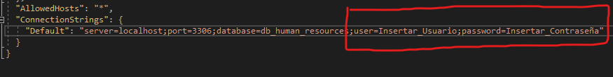

## Instalación
Primero debemos copiar o importar el archivo SQL "script_human_resources.sql", en una sesión activa de una conexión con nuestra base de datos local debemos ejecutar el script para la creación de las tablas necesarias.
Después debemos abrir el proyecto con Microsoft Visual 2019 y en el Explorador de Soluciones debemos buscar el archivo "appsettings.json".
En este archivo debemos cambiar las credenciales de conexión como user y password por las credenciales que usamos para conectarnos a nuestra base de datos local.

Finalmente debemos ejecutar el proyecto este nos mandará al api en nuestro navegador elegido.

